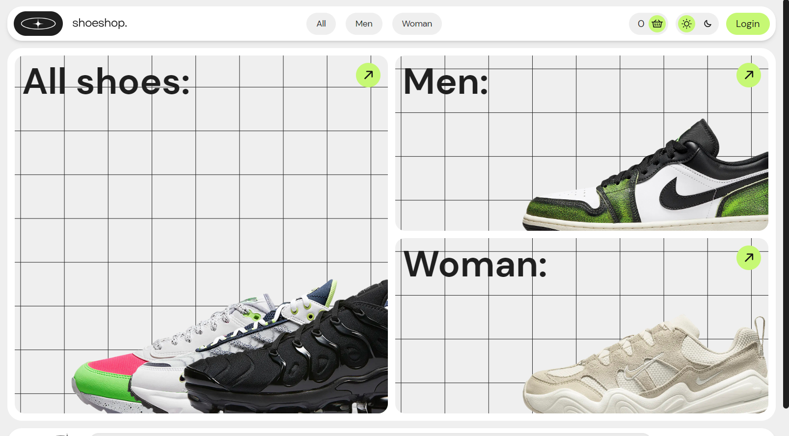
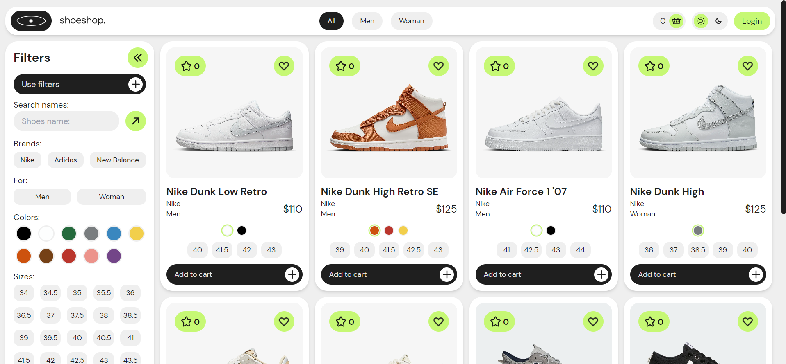
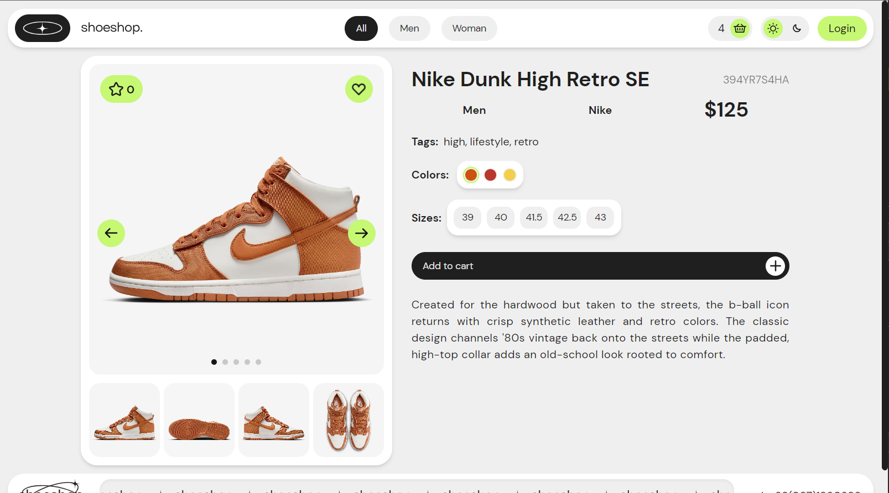
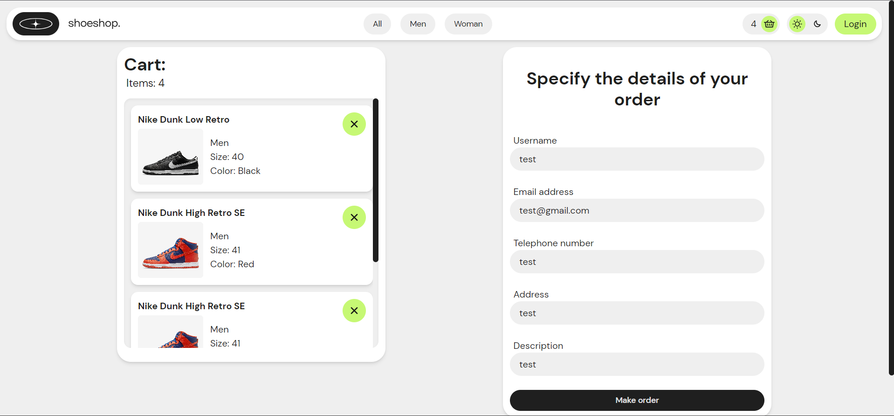
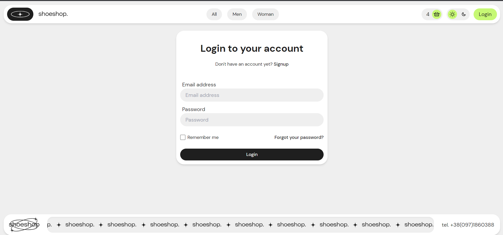
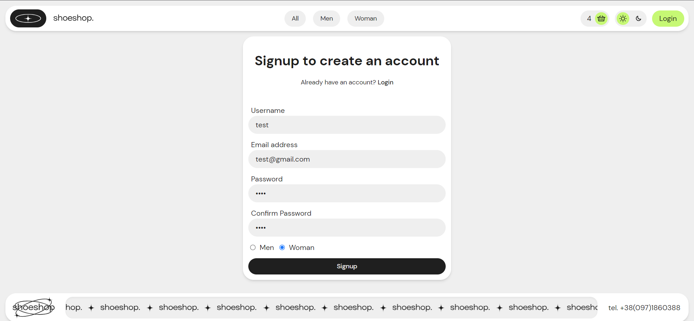

<h1 align="center">⚡️👞👟🥾 Shoe Store Project 🥾👟👞⚡️</h1>
<h2 align="center">A complete fullstack project for an online shoe store</h2>

The front-end of the site has a bunch of animations, images sliders, nice adaptive changes, dark and light mode, <b>pagination, filters</b>, a shopping cart window, a well-thought-out system of switching between pages. Has a registration and authorization page. The frontend displays information from the developed database received through the API service.

<h2>Used technology stack:</h2>
<table>
  <tr>
    <td>Frontend</td>
    <td>Backend</td>
  </tr>
  <tr>
    <td><ul>
  <li>React</li>
  <li>React Router DOM (react-dom)</li>
  <li>React Redux</li>
  <li>Redux Toolkit</li>
  <li>SASS (sass)</li>
  <li>Tailwind CSS</li>
  <li>React Toastify (react-toastify)</li>
  <li>React Paginate (react-paginate)</li>
  <li>Swiper (swiper)</li>
  <li>Lottie React (lottie-react)</li>
  <li>Axios (axios)</li>
</ul></td>
    <td><ul>
  <li>Node.js</li>
  <li>Express.js</li>
  <li>JWT (jsonwebtoken)</li>
  <li>mongoose</li>
  <li>CORS (cors)</li>
</ul></td>
  </tr>
</table>

MongoDB was also used as a database and Postman API was used to test API services.

<h2>Project Features:</h2>
<ul>
  <li><b>Pagination</b></li>
  <li><b>Filter products in server side</b></li>
  <li>JWT</li>
  <li>Cart</li>
  <li>Light and dark mode</li>
  <li>Full responsive and adaptive</li>
  <li><b>Redux Toolkit state management</b></li>
  <li><b>RTK Query and AsyncThunk</b></li>
  <li>Custom Tailwind CSS setup</li>
</ul>

<h2 align="center">Images for the project:</h2>
<h3>Main page:</h3>
</img>
</img>

<h3>Products page:</h3>
</img>
</img>
</img>

<h3>Product page:</h3>
</img>
</img>

<h3>Cart page:</h3>
</img>

<h3>Login/Register pages:</h3>
</img>
</img>

<h2>Product data example:</h2>
<code>
[ 
  { 
    "code": "", 
    "name": "", 
    "brand": "", 
    "price": 0.0, 
    "description": "", 
    "gender": "", 
    "tags": ["", ""], 
    "saleCount": 0, 
    "aggregateRating": { 
      "ratingValue": 0.0, 
      "reviewCount": 0 
    }, 
    "variants": [ 
      { 
        "color": "", 
        "sizes": [0, 0, 0], 
        "images": ["", "", "", "", ""] 
      } 
    ], 
    "commentsId": [] 
  } 
] 
</code>
